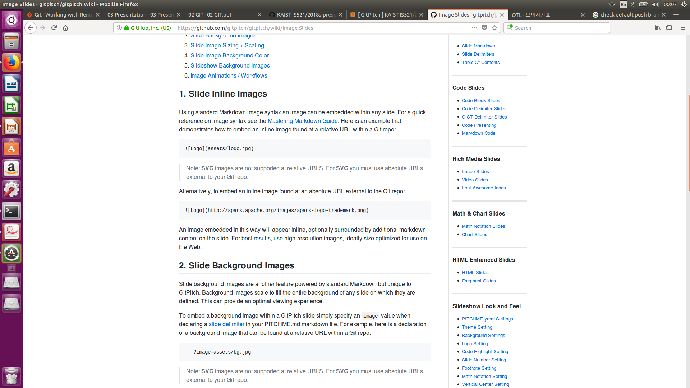

# MICE

* Mincheol Son
* Dauren Serkeshev
* Seong Ho Han
* Jiwon Choi

_TA: Geonwoo Kim_

---

### TEAM INTRODUCTION

 **MICE**
> **M**echanical engineering(name 1)  
  **I**ndustrial engineering(Dauren Serkeshev)  
  **C**omputer science(name 2)  
  **E**letrical engineering(name 3)  

Note:
During our first team meeting we discovered that we all came from different backgrounds,
so we wanted to reflect this in our team name 

---

### Dauren Serkeshev

* From Kazakhstan
* Majoring in Industrial Engineering
* Research in Reinforcement Learning

---

### Environment

* bash
* vim
* mutt email client
 

---

### screenshot 

---

### CONCLUDING REMARK

Try to make a good final impression here. You should try to make people want to
know more about you. Each team can spend at most 1 min. for both introduction
and conclusion slide.

